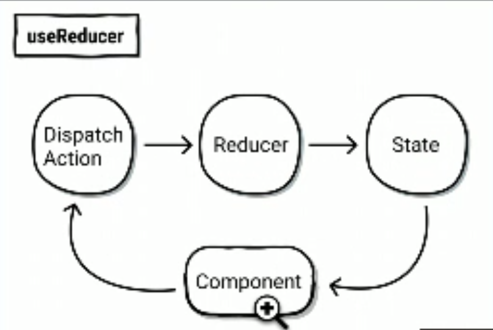

# reactjs-learning-note

## JS ES6

### Scope Chain
+ 有就找{}，沒有往外找
+ let, const 比 var 更嚴謹

### Prototype Chain
+ 每個物件都有__proto__

### OOP
+ 參數有找到就停，沒有則往上找

### this
+ arrow function 沒有 this
+ apply, call, bind 會改變 this 的值
+ new (自動 return)
+ use strict

### Promise
+ 跳脫 callback hell
+ resolve example:
  ```
    return new Promise((resolve) => {
      setTimeout(() => {
        resolve(name);
      }, 1000);
    });
  ```
+ reject example:
  ```
   return new Promise((resolve, reject) => {
      setTimeout(() => {
        reject(new Error('Promise error'));
      }, 1000);
    });
  ```
+ use : 
  + then, catch, finally
  + await + try, catch, finally (IE 不能用，babel 會轉譯)
+ Promise.all: 全部執行完進 then
+ Promise rise: 有一執行完就進 then

### JS Event
+ Event Bubbling: mouse event 才有
+ Event Capturing
+ Event Delegation
+ e.target vs e.currentTarget
  + e.target: this
  + e.currentTarget: 觸發事件的元素

* * *
## ReactJS

> ### 優點
> + 前後端分離
> + data binding
> + React(JSX為編譯語言) =(透過 webpack)=> 直譯語言
> + 解決 JS / CSS 變數覆蓋
>
> ### 缺點
> + virtual dom 速度快，SEO 下降
> > 解決方式: 
> >
> > react server side render(須以node js啟動)
> >
> > 建立爬蟲用html(header判斷)

### useState vs useState
+ useState 更新 > 觸發 render
+ useRef   更新 > 不會重render，僅記錄變數值

### setCount
+ 等等可以更新 != 馬上更新、重新渲染

### useEffect vs useLayoutEffect
+ useEffect
  + virtual dom -> html dom -> useEffect
  + 執行順序
    + dependency Array 有更新
    + React render
    + Browser 更新畫面
    + useEffect 執行


+ useLayoutEffect
  + 當畫面遇到閃爍問題才需要使用
  + 執行順序
    + dependency Array 有更新
    + React render
    + useLayoutEffect 執行, 然後 React 會等他結束
    + Browser 更新畫面

### useMemo, useCallback
+ 優化用

### Context
> 一般規則： component 資料只能一等親傳遞 (父<===>子)
+ 優點：可跨組件溝通
+ 缺點：
  + 效能低落，建議在小範圍使用
  + 有用到 Context 的其中一個 Component 觸發，所有 Context 內 Component 重新渲染
+ 用法：
  + 當 Component 在 Context.Provider 裡時，可以用 useContext 拿到參數
  + 當 Component 不在 Context.Provider 裡時，useContext 就會拿到預設值

### children
+ children 可以當 function 使用也可以當 jsx
+ jsx
  + 定義/傳送參數
  ```
  <Example1>
    {(name) => (
      <section data-name="inner">
        <h1>children:{name}</h1>
      </section>
    )}
  </Example1>
  ```
  + 使用檢查
  ```
  type Props = {
    children: ((name: string) => React.JSX.Element),
  };
  
  const child = typeof children === 'function' ? children(name) : children;
  ```

+ function
  + 定義/傳送參數
  ```
  <Example2RenderFunction
    render={(name) => (
      <section data-name="inner">
        <h1>render:{name}</h1>
      </section>
    )}
  />
  ```
### useImperative
+ 作用：生成讓 父 Component 呼叫子 Component 的 function
  ```
  const MyInput = React.forwardRef((props, ref) => {
    React.useImperativeHandle(ref, () => {
      return {
        getCustomText() {
          return input;
        }
      };
    }, [input]);
  });

  const inputRef = React.useRef(null);
  
  const atShowInputClick = () => {
    setName(inputRef.current.getCustomText());
  };
  ```

### Reducer
+ 經過 Reducer 處理完，一定回傳一個新的 state
+ 運作流程圖：
  

### Redux
+ dispatch 後，所有 reducer 都會被觸發

* * *
### react v17, v18 切換
+ index.js 中 ReactDOM 使用方式不同
+ v17
  ```
  ReactDOM.render(<App />, document.getElementById('root'));
  ```
+ v18
  ```
  const root = ReactDOM.createRoot(document.getElementById('root'));
  root.render(<App />);
  ```

### jsdoc 定義型態

```
  /**
   * @type {React.MutableRefObject<HTMLInputElement>}
   */
```

### css 管理
+ css modules + scss (推)
  ```
  import cx from 'classnames';
  import style from './Example5.module.scss';
  
  <section data-name="example05" className={style.root} data-show={show}>
    <button className={cx(style.button, { active: show, })}>Switch</button>
  </section>
  ```
  > p.s 若想不 hash class 名稱
  > ```
  > &:global(.active) {
  >    background-color:#e74c3c;  
  > }
  > ```
+ css in js
  + emotion/css (不推) 
    + 後臺上稿時可以用 emotion 包起來
     ```
     <section data-name="example01" className={rootStyle}></section>
     ```
  + emotion/react (不推!!!)
    + 用越多，效能越差
    ```
    /**  @jsxImportSource @emotion/react */
    
     <section data-name="example02" className="example02" css={rootStyle}></section>
    ```
  + emotion/styled (不推!!!)
    + style component => 讓團隊誤會意義

### CORS 問題解決
+ webpack.config 加 proxy 設定
```
proxy: [
      {
        context: ['/api'],
        target: 'https://k9wvmn0z75.sse.codesandbox.io',
        changeOrigin: true,
      },
    ],
```

+ APP.js
```
<TodoList apiURL="/api/todolist/annie" />
```

### 支援 IE
+ .babelrc 設定
```
"browsers": [
  "> 2%",
  "last 2 versions",
  "IE >= 11"
]
```

### Tips
+ 快速註解，去掉第一個 '/' 直接註解
```
  //*
  .........here is my code..........
  // */
```
+ webpack.config 加自定義路徑設定
```
  resolve: {
    modules: [path.resolve('src'), path.resolve('node_modules')],
      alias: {
        '@': path.resolve('src'),
      },
      extensions: ['.js', '.jsx'],
    },
 ```

### Extension
+ [React Developer Tools](https://chrome.google.com/webstore/detail/react-developer-tools/fmkadmapgofadopljbjfkapdkoienihi)
+ [JSON Formatter](https://chrome.google.com/webstore/detail/json-formatter/bcjindcccaagfpapjjmafapmmgkkhgoa?hl=zh-TW)
+ [Redux DevTools](https://chrome.google.com/webstore/detail/redux-devtools/lmhkpmbekcpmknklioeibfkpmmfibljd?hl=zh-TW)

### Source
+ [使用ESLint, Prettier, Husky, Lint-staged以及Commitizen提升專案品質及一致性](https://medium.com/@danielhu95/set-up-eslint-pipeline-zh-tw-990d7d9eb68e)
+ [Type Checking with PropTypes](https://zh-hant.reactjs.org/docs/typechecking-with-proptypes.html)
+ [flow js](https://flow.org/)
+ [react-use](https://github.com/streamich/react-use)
+ [redux-thunk](https://github.com/reduxjs/redux-thunk)
+ [plop js](https://plopjs.com/)

* * *
### 課堂練習
> [老師講義](https://reurl.cc/DvxXEN)
> 
> [Homework 2022.04.18](https://codesandbox.io/s/01-conditional-render-question-forked-gjnsrs)
> 
> [Homework 2022.04.22](https://codesandbox.io/s/02-countdown-question-forked-o8c2wl) 
>
> 